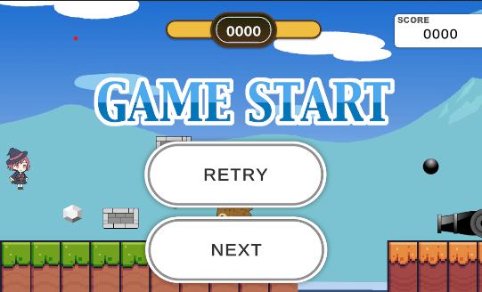
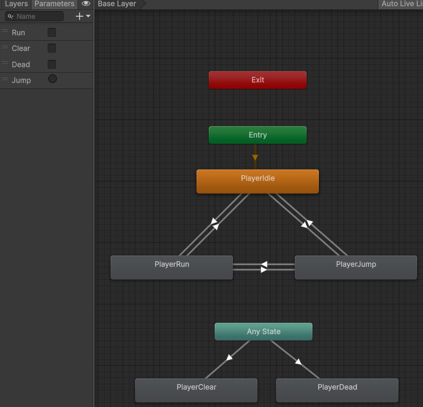

# JewelryHunter_Unity6_re

[ゲームのサンプルプレイ](https://github.com/tomi119000/JewelryHunter_web.git)



## 訓練校で学習する初2D作品
* Playerの操作
* アニメーションの作り方
* タグやレイヤーの使い方  
など、基本を学んでいます。

## 制作のポイント
### アニメーションをトランジションで作成
Playerのアニメの切り替えには各クリップをトランジションでつないでフラグで管理しました。
トランジションを組むことで、アニメ切り替えが滑らかになり、且つコーディングが効率的なものになりました。


*******************************
--------------------------
見出し
# H1見出し
## H2見出し
#### H4見出し

H1見出し（イコール行を挿入。）
==================
H2見出し（ハイフン行を挿入。）
---------------------------------

改行
行末に半角スペース2つ  
または普通に改行

**太字**
__これも太字__
_斜体_
~~取り消し~~
<ins>下線</ins>

水平線
3つ以上のハイフン、アスタリスクをならべる。間にスペースをいれても良い
***
---------------------------------------
* * *


リスト
* リスト1
* リストリスト1-2
* リスト2

1. 順番つきリスト
2. 順番つきリスト
3. 順番つきリスト


リンク
<http://google.com/>
文字にリンクをつける
[google](http://google.com/)


コード埋め込み
```C#
string s1 = "バッククォーテーション３つで囲みます";
string s2 = "先頭のクォーテーション後に言語名でハイライトされます";
if(s1 != null && s2 != null)
{
	Debug.Log(s1 + s2);
}
```


引用
> 引用本文引用本文引用本文引用本文


画像

